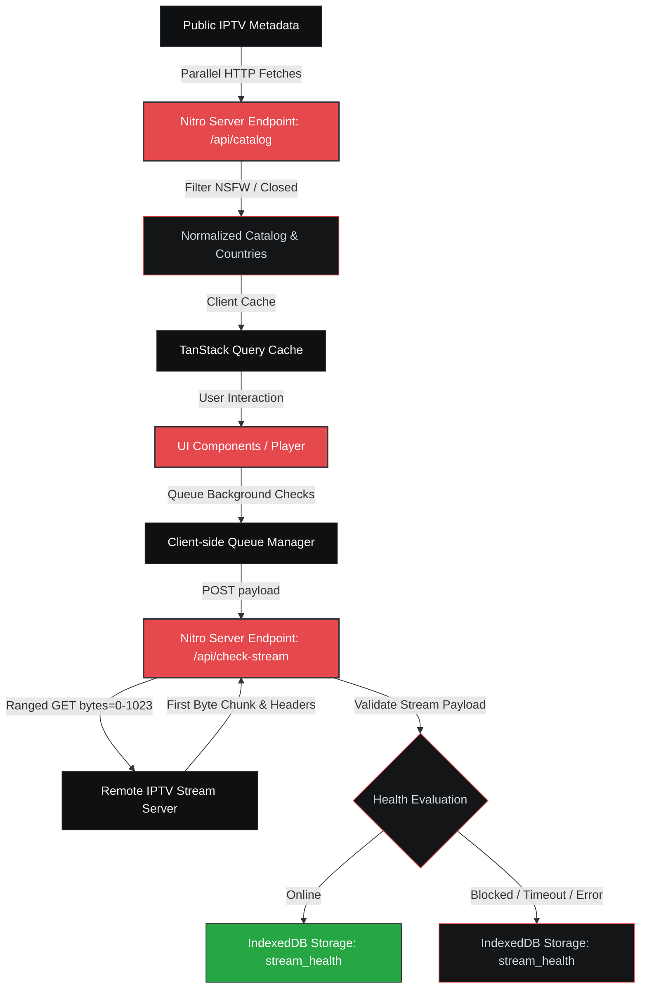
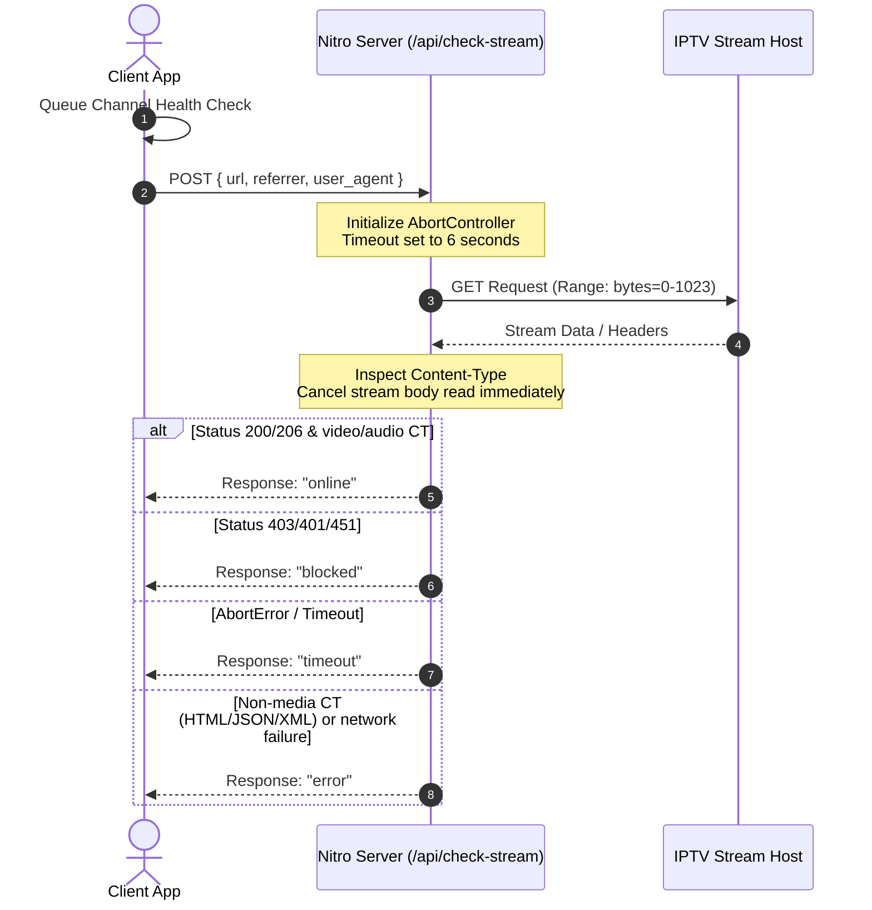
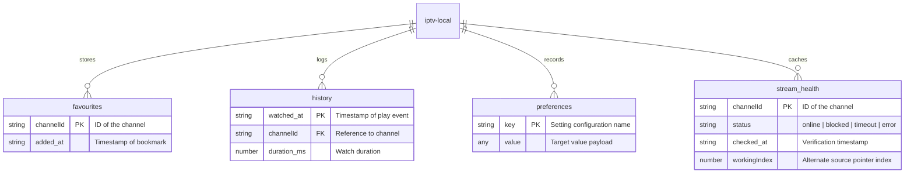

<p align="center">
  
</p>

<h1 align="center">P U L S E</h1>

<p align="center">
  <strong>FEEL EVERYTHING</strong>
</p>

<p align="center">
  A production-ready, custom-engineered IPTV streaming client built for absolute performance, verified stream viability, and a minimal obsidian-inspired design system.
</p>

<p align="center">
  
  
  
  
  
</p>

---

## Table of Contents

- [User Interface Layout](#user-interface-layout)
- [Complete Feature Catalog](#complete-feature-catalog)
- [Architectural Pipelines](#architectural-pipelines)
  - [1. Catalog Ingestion & Geographic Routing](#1-catalog-ingestion--geographic-routing)
  - [2. Stream Health Check Sequence](#2-stream-health-check-sequence)
- [Persistent Database Schema](#persistent-database-schema)
- [Design System & Color Swatches](#design-system--color-swatches)
- [Fluid Wave Mathematics](#fluid-wave-mathematics)
- [Local Development & Operations](#local-development--operations)
- [Deploying to Vercel](#deploying-to-vercel)
- [License](#license)

---

## User Interface Layout

The interface layout divides screen space dynamically between catalogs and player functions:

```
┌────────────────────────────────────────────────────────────────────────────────────────┐
│  P U L S E  [Search channels...]                                    [ US ]  Favs  Browse │
├─────────────────────────────────────────┬──────────────────────────────────────────────┤
│ News    Sports    Movies   Entertainment│                                              │
├─────────────────────────────────────────┤                                              │
│ [Live] BBC News                         │             NATIVE HLS STREAMING             │
│   - United Kingdom                      │                 [ hls.js ]                   │
│                                         │                                              │
│ [Live] Sky Sports Premier League        │                                              │
│   - United Kingdom                      │                                              │
│                                         │                                              │
│ [Slow] Euronews                         │                                              │
│   - France                              │                                              │
│                                         │                                              │
│ [Off ] Movie Zone                       │      [||] Play   [M] Mute   [1080p]  [ [ ] ] │
│   - Germany                             ├──────────────────────┬───────────────────────┤
│                                         │ Favourites Toggler   │ Mini-Player Overlay   │
└─────────────────────────────────────────┴──────────────────────┴───────────────────────┘
```

---

## Complete Feature Catalog

Pulse contains dozens of specialized features designed for a premium, bulletproof streaming experience:

### 📺 Media & Playback Engine

- **Hybrid HLS Playback**: Adapts dynamically between the high-performance `hls.js` engine (configured with worker threads and custom HTTP Referer settings) and native iOS/Safari `.m3u8` player bindings.
- **Alternate Stream Failover**: If the primary stream encounters network or media errors, the player automatically iterates and falls back to alternate stream sources mapped to the channel.
- **Manual Quality Lock**: Decodes manifest levels to let users manual-lock specific resolutions (e.g. `1080p`, `720p`, `480p`) or toggle back to adaptive auto-bitrate algorithms.
- **Double-Tap Interaction**: Clicking or tapping the video area toggles play/pause state instantly, using double touch-guards to eliminate the standard mobile 300ms delay.
- **Fullscreen Orientation Lock**: On mobile devices, entering fullscreen mode automatically locks screen orientation to landscape utilizing the Screen Orientation API, returning to system-default upon exit.
- **Auto-Hide Controls Timer**: Controls fade out automatically after 2.5s of mouse/touch inactivity, restoring visibility instantly on coordinate movements.

### 🔍 Search & Filtering

- **Universal Omnibar Command Center**: Pressing <kbd>Cmd</kbd>/<kbd>Ctrl</kbd> + <kbd>K</kbd> triggers a fuzzy search modal showcasing history, categories, countries, and live channels.
- **Intersecting Filter Pills**: Search queries can narrow down results using interactive pills (e.g., category: `News` + country: `Germany` + text: `Tagesschau`).
- **Debounced Search queries**: Restricts search processing with a `150ms` debouncing window, preventing DOM rendering bottlenecking on rapid keyboard inputs.
- **Dynamic Sidebar Filter Panels**: Fully responsive drawer panels on mobile and sidebar controls on desktop allow filtering by countries, category segments, and language tags.

### 🌐 Connectivity & Localization

- **GeoIP Locale Fallback**: Detects locale timezone codes and triggers a background payload to `ipapi.co/json` to determine the user's country and prioritize local feeds.
- **Network Status Listeners**: Attaches window-level listeners that watch `online` and `offline` states to automatically freeze polling queues and toast warnings if the connection drops.
- **Dynamic Sitemap compilation**: Serves a serverless sitemap route `/sitemap.xml` that updates indexes dynamically for search crawler optimization.

### ⚙️ Database & Offline Storage

- **IndexedDB Favourites Sync**: Relies on transaction-safe database stores for bookmarks, dispatching CustomEvents to update favorited cards across different routes.
- **History Trimming (Garbage Collection)**: Automatically caps the watched history index to a maximum of 200 records, sorting and deleting the oldest rows.
- **Stream Health Caching**: Cache health checks locally in IndexedDB to avoid repeating network validation checks on channels loaded into lists.

### 📱 Progressive Web App (PWA)

- **Adaptive Install Prompts**: Custom browser detectors show custom prompts for Android/Chrome installs or iOS manual Safari Share action instructions.
- **Standalone Display Layouts**: Implements responsive display adjustments specifically for PWA standalone containers, checking safe-area-insets dynamically.
- **Static Assets Caching Service Worker**: Pre-caches static shell endpoints (`/` and `/browse`) using a cache-first strategy in `sw.js`, bypassing caching only for dynamic API routes.

---

## Architectural Pipelines

Pulse relies on structured serverless routing to compile directories and verify media stream payloads without hitting client CORS or sandbox limitations.

### 1. Catalog Ingestion & Geographic Routing

The compiler pulls live listings in parallel, filters NSFW channels, translates country codes to emojis, and streams it back to the client-side TanStack Query cache.



---

### 2. Stream Health Check Sequence

Many IPTV servers block standard HEAD checking. Pulse invokes ranged GET operations, parsing headers and cancelling body retrieval after the first chunk.



---

## Persistent Database Schema

Pulse offloads core client state to **IndexedDB** (`iptv-local`), guaranteeing clean, non-blocking storage transactions.



---

## Core Capabilities Matrix

| Area       | Feature               | Description                                                  | Status |
| :--------- | :-------------------- | :----------------------------------------------------------- | :----- |
| **Media**  | Native HLS & `hls.js` | Dual fallback streaming engine with volume caching           | Ready  |
| **PWA**    | Cache-first `sw.js`   | Service worker handles offline static caching of page routes | Ready  |
| **State**  | Favourites Hooks      | Event-driven React hooks that sync browser IndexedDB changes | Ready  |
| **Search** | Keyboard Omnibar      | Global command palette triggered by shortcuts                | Ready  |
| **GeoIP**  | Country Sorting       | Locale defaults fallback to ipapi.co to float local channels | Ready  |

---

## Design System & Color Swatches

Pulse utilizes a dark-mode first canvas featuring deep surfaces and vibrant status accents. These swatches represent the exact hexadecimal targets in `styles.css`.

| Variable           | Visual Swatch                                                                                       | Semantic Target          | HSL Mapping          |
| :----------------- | :-------------------------------------------------------------------------------------------------- | :----------------------- | :------------------- |
| `--surface-base`   |     | Root Canvas Background   | `hsl(240, 10%, 1%)`  |
| `--surface-1`      |  | Primary Panels & Shelves | `hsl(210, 8%, 6%)`   |
| `--border-default` |   | Element Boundaries       | `hsl(225, 10%, 15%)` |
| `--accent`         |   | Crimson Red Action Items | `hsl(358, 76%, 59%)` |
| `--status-online`  |   | Live & Verified Streams  | `hsl(134, 62%, 41%)` |
| `--status-blocked` |  | Restricted Geo-Zones     | `hsl(0, 100%, 69%)`  |

---

## Fluid Wave Mathematics

The canvas-based entrance gateway (`ImmersiveLanding.tsx`) renders animated waveforms using high-performance mathematical equations:

$$y = \text{baseHeight} - \sin(x \cdot \text{frequency} + \text{phase}) \cdot \text{amplitude}$$

- **Phase Accumulators**: Individual timers mutate wave coordinates (`phase1`, `phase2`, `phase3`) at variable speeds.
- **Cursor Influence**: Captures coordinate delta $d = |x - x_{\text{cursor}}|$. If $d < 320$, amplitude scales by a localized factor:
  $$\text{amplitude}_{\text{active}} = \text{amplitude} + \left(1 - \frac{d}{320}\right) \cdot 16 \cdot \sin(\text{phase} \cdot 1.2)$$

---

## Local Development & Operations

### Prerequisites

- Node.js runtime environment (version `>=20.0.0`)
- `pnpm` Package Manager

### Installation & Launch

```bash
# Install package dependencies
pnpm install

# Run the local Vite dev server
pnpm run dev
```

### Static Quality Verification

```bash
# Format code structure using Prettier
pnpm run format

# Audit codebase lint rules
pnpm run lint
```

---

## Deploying to Vercel

Pulse is fully pre-configured to build on Vercel.

> [!TIP]
> **Vercel Settings**:
>
> 1. Set the **Framework Preset** to **Other** (or let Vercel auto-detect the Vite build).
> 2. Ensure the build command is set to `pnpm run build`.
> 3. Verify the output directory is set to `.vercel/output`.
> 4. Ensure you use Node.js version `20.x` or higher in your project settings.

---

## Tribute & Acknowledgement

Pulse is made possible by the dedicated contributions of the open-source IPTV database communities. We extend our gratitude and tribute to:

- **The IPTV-Org Project**: For compiling and maintaining the comprehensive database of public television broadcasts, logos, and streams worldwide.
- **Open-Source Stream Curators**: The community of maintainers and contributors who ensure public broadcasts remain accessible to all.

---

## License

This project is licensed under the MIT License - see the [LICENSE](./LICENSE) file for details.
